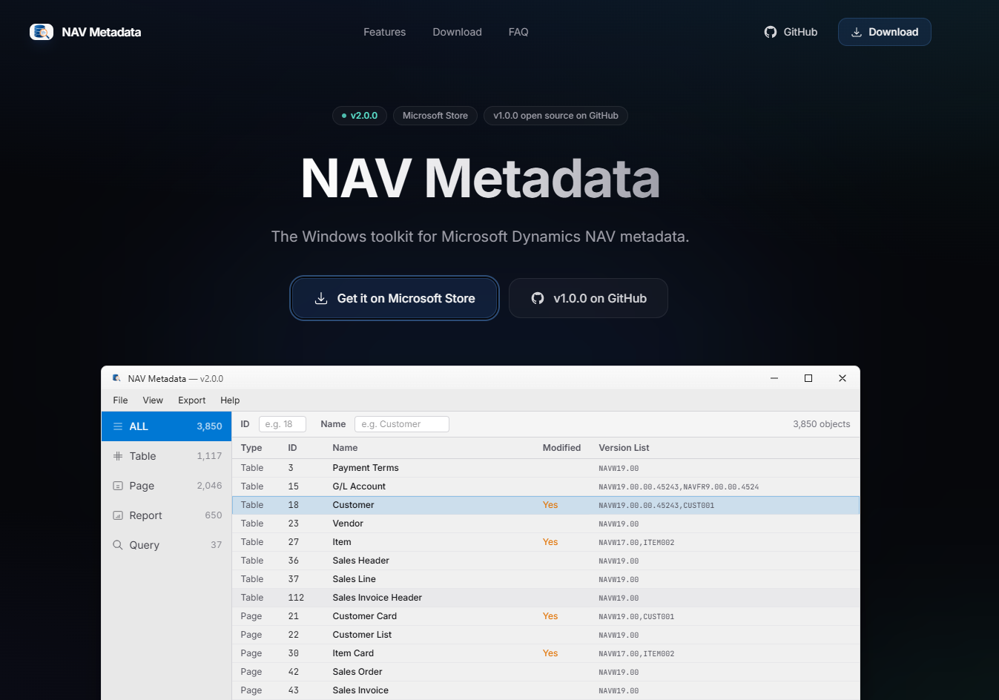
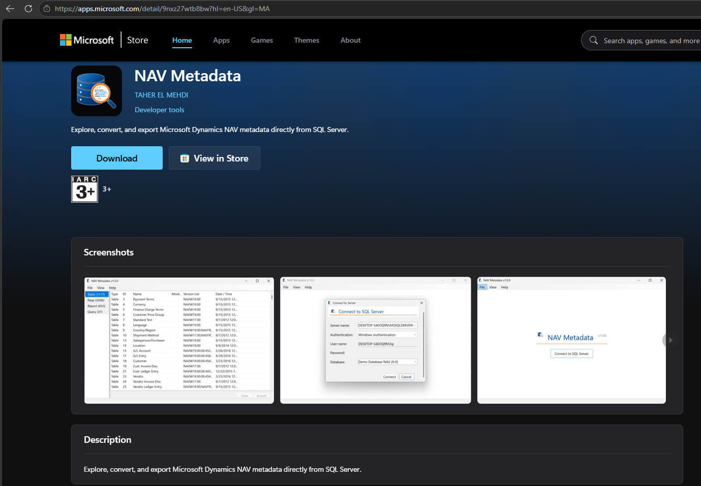
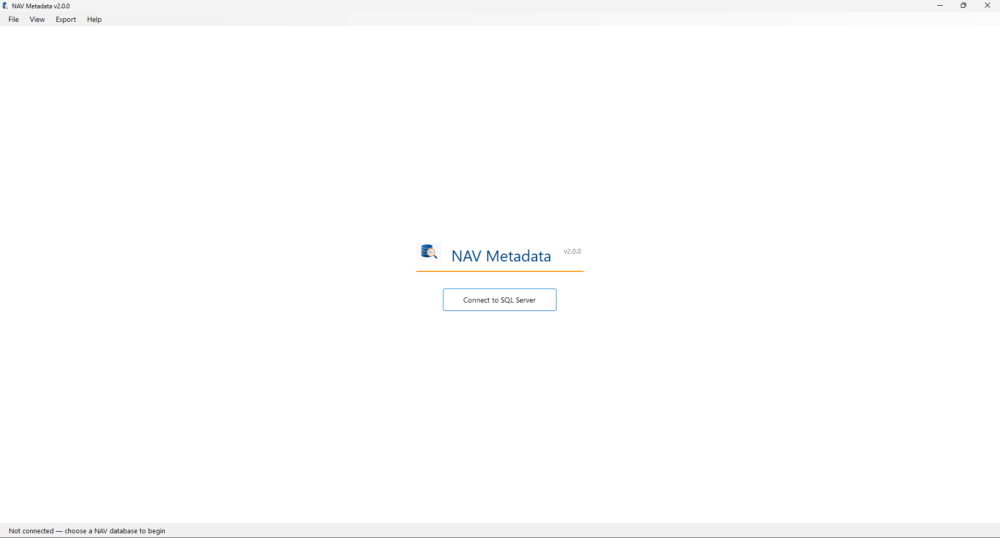
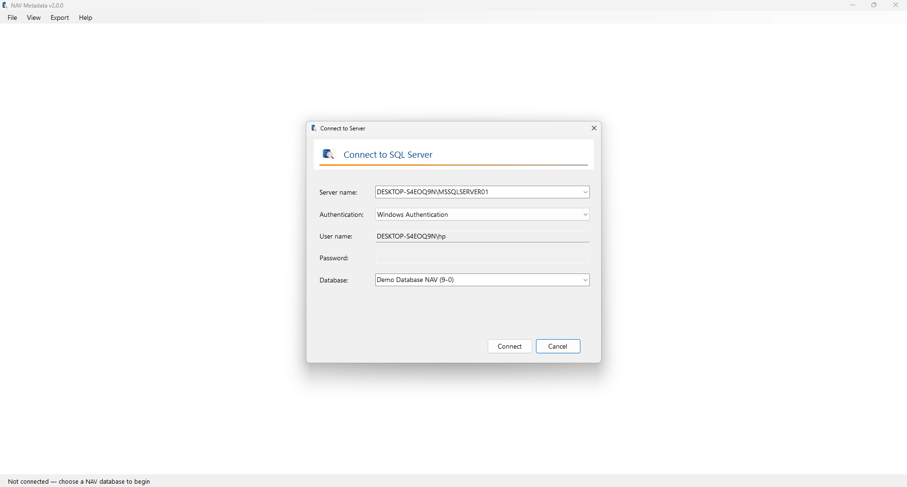
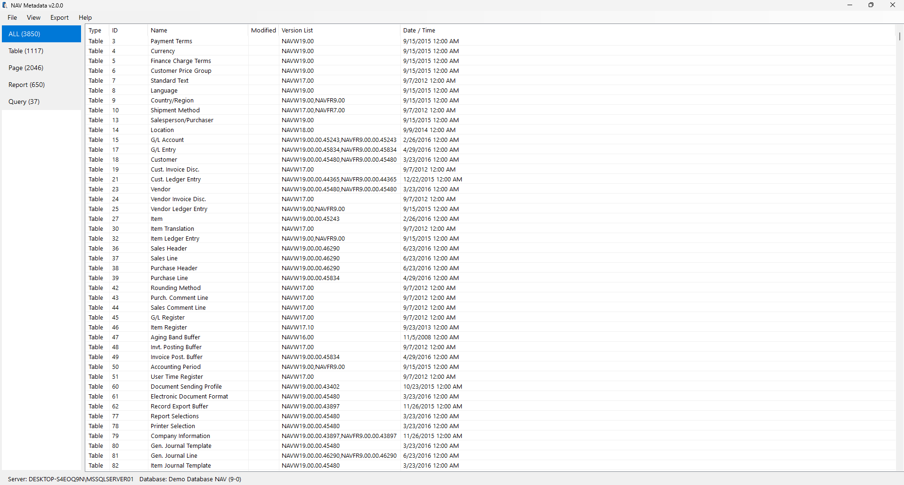
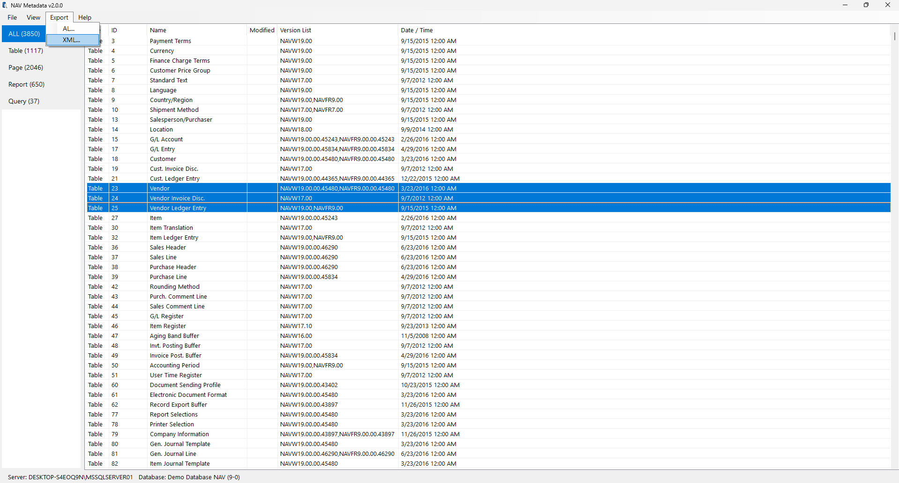
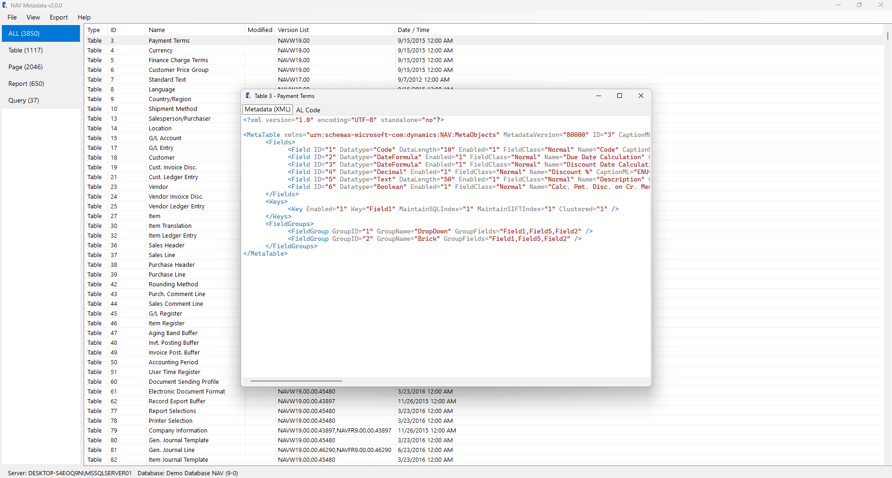
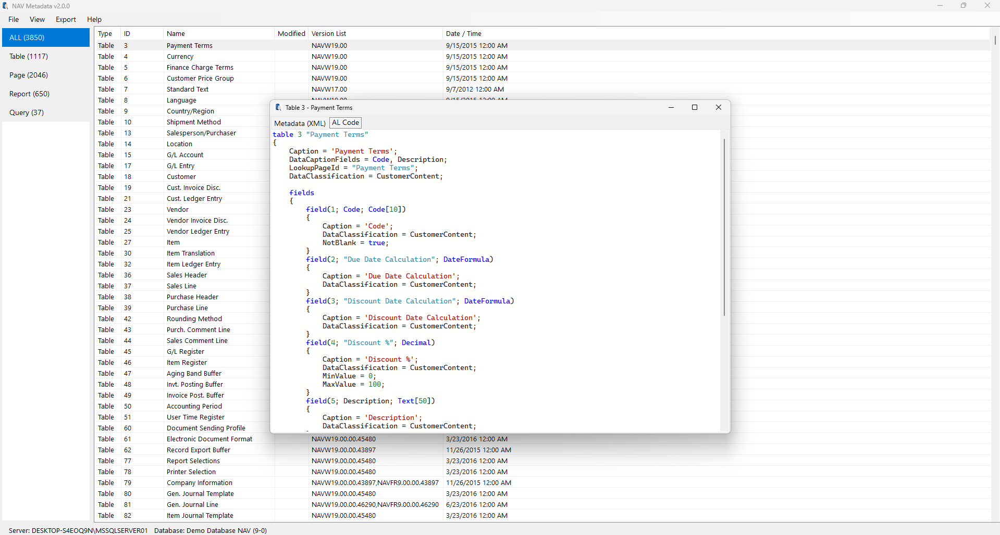

# NAV Metadata (Community Edition)

[](https://opensource.org/licenses/MIT)
[](https://dotnet.microsoft.com/)
[](https://learn.microsoft.com/dotnet/desktop/winforms/)
[](https://www.microsoft.com/windows)
[](https://navmetadata.com/)
[](https://www.microsoft.com/sql-server)
[](https://apps.microsoft.com/detail/9NXZ27WTB8BW?hl=en-us&gl=AE&ocid=pdpshare)

**The open-source Windows desktop toolkit for Microsoft Dynamics NAV metadata.**

Browse application objects, inspect decompressed metadata XML, and export metadata directly from your Microsoft Dynamics NAV SQL Server database.

🌐 **Website:** https://navmetadata.com

🛒 **Microsoft Store (latest):** [NAV Metadata](https://apps.microsoft.com/detail/9NXZ27WTB8BW?hl=en-us&gl=AE&ocid=pdpshare)

---

# Community Edition

This repository contains **NAV Metadata Community Edition (v1.x)**.

It provides the core features for exploring Microsoft Dynamics NAV metadata and will remain available under the **MIT License**.

Starting with **NAV Metadata v2**, development continues as a commercial edition distributed through the **Microsoft Store**.

The Community Edition will remain available for anyone who wants to learn from it, use it, or build upon it under the MIT License.

---

# Features

- Connect directly to Microsoft Dynamics NAV SQL Server databases
- Browse Tables, Pages, Reports, Queries, XMLPorts, Codeunits, and more
- View decompressed **Object Metadata** XML
- Syntax-highlighted XML viewer
- Export metadata XML files
- Fast search and filtering
- Windows Authentication & SQL Server Authentication
- Automatic update notifications
- Runs locally
- No telemetry
- Open Source (MIT)

Supports Microsoft Dynamics NAV databases exposing the standard **Object** and **Object Metadata** system tables (NAV 2009–2018).

---

# Looking for the latest version?

NAV Metadata has continued to evolve beyond the Community Edition.

The latest releases include additional capabilities such as:

- Metadata → AL conversion
- Multi-object export
- Enhanced browsing experience
- Additional productivity features
- Ongoing improvements and new functionality

Get the latest version:

- 🛒 **Microsoft Store:** [NAV Metadata](https://apps.microsoft.com/detail/9NXZ27WTB8BW?hl=en-us&gl=AE&ocid=pdpshare)
- 🌐 **Website:** https://navmetadata.com

---

# Screenshots

A quick walkthrough of **NAV Metadata v2** — from download to browsing, exporting, and viewing metadata.

### Website & Microsoft Store

<p align="center">
  
</p>

<p align="center"><em>Official website — get the latest release or the open-source Community Edition</em></p>

<p align="center">
  
</p>

<p align="center"><em>Available on the <a href="https://apps.microsoft.com/detail/9NXZ27WTB8BW?hl=en-us&gl=AE&ocid=pdpshare">Microsoft Store</a></em></p>

### Home

<p align="center">
  
</p>

<p align="center"><em>Clean start screen — connect to your NAV SQL Server database to begin</em></p>

### Connect to SQL Server

<p align="center">
  
</p>

<p align="center"><em>Connect with Windows or SQL Server authentication and pick your NAV database</em></p>

### Browse objects

<p align="center">
  
</p>

<p align="center"><em>Browse Tables, Pages, Reports, Queries, and more with fast filtering</em></p>

### Multi-select & export

<p align="center">
  
</p>

<p align="center"><em>Select multiple objects and export as XML or AL</em></p>

### Metadata (XML)

<p align="center">
  
</p>

<p align="center"><em>Inspect decompressed Object Metadata XML with syntax highlighting</em></p>

### AL Code

<p align="center">
  
</p>

<p align="center"><em>Convert and preview metadata as AL code</em></p>

---

# Download

### Latest (v2) — Microsoft Store

Install the current edition from the Microsoft Store:

👉 **[Get NAV Metadata on Microsoft Store](https://apps.microsoft.com/detail/9NXZ27WTB8BW?hl=en-us&gl=AE&ocid=pdpshare)**

### Community Edition (v1) — GitHub

Community Edition releases remain available on GitHub.

- **Setup Installer** (recommended)
- **Portable ZIP**

For more details, visit:

🌐 **https://navmetadata.com**

---

# Build from source

```bash
git clone https://github.com/taher-el-mehdi/nav-metadata-app.git

cd nav-metadata-app

dotnet build -c Release

dotnet run -c Release
```

---

# Tech Stack

- C#
- .NET 10
- Windows Forms
- Microsoft.Data.SqlClient
- Serilog
- Microsoft.Extensions.DependencyInjection

---

# Privacy

NAV Metadata Community Edition does not collect analytics or transmit database content.

All metadata is processed locally on your computer.

---

# License

This repository contains **NAV Metadata Community Edition** and remains licensed under the **MIT License**.

© 2026 Taher El Mehdi
